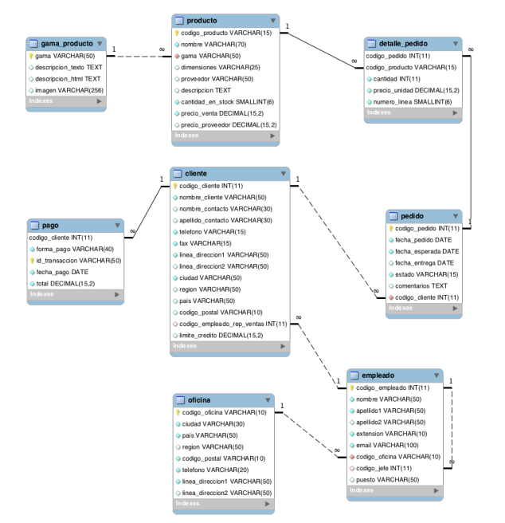

Consultas sobre una tabla

/*1.Devuelve un listado con el código de oficina y la ciudad donde hay oficinas.*/

SELECT ciudad,codigo_oficina
FROM oficina;

/*2. Devuelve un listado con la ciudad y el teléfono de las oficinas de España.*/

SELECT ciudad,telefono
FROM oficina
WHERE pais = 'España';

/*3. Devuelve un listado con el nombre, apellidos y email de los empleados cuyo
jefe tiene un código de jefe igual a 7.*/

SELECT nombre,apellido1,apellido2,email
FROM empleado
WHERE codigo_jefe = 7;

/*4. Devuelve el nombre del puesto, nombre, apellidos y email del jefe de la
empresa.*/

SELECT puesto,nombre,apellido1,apellido2,email
FROM empleado
WHERE puesto = 'jefe' OR puesto = 'Jefe';

/*5. Devuelve un listado con el nombre, apellidos y puesto de aquellos
empleados que no sean representantes de ventas.*/

SELECT nombre, apellido1, apellido2, puesto
FROM empleado
WHERE puesto != 'representante de ventas';

/*6. Devuelve un listado con el nombre de los todos los clientes españoles.*/

SELECT nombre
FROM cliente
WHERE pais = 'España';

/*7. Devuelve un listado con los distintos estados por los que puede pasar un
pedido.*/

SELECT estado
FROM pedido;

/*8. Devuelve un listado con el código de cliente de aquellos clientes que
realizaron algún pago en 2008. Tenga en cuenta que deberá eliminar
aquellos códigos de cliente que aparezcan repetidos. Resuelva la consulta:*/
/*• Utilizando la función YEAR de MySQL.*/
SELECT DISTINCT codigo_cliente 
FROM pago 
WHERE YEAR(fecha_pago) = 2008
;

/*• Utilizando la función DATE_FORMAT de MySQL.*/
SELECT DISTINCT codigo_cliente 
FROM pago
WHERE DATE_FORMAT(fecha_pago, '%Y') = 2008

/*• Sin utilizar ninguna de las funciones anteriores.*/
SELECT DISTINCT codigo_cliente 
FROM pago 
WHERE fecha_pago BETWEEN '2008-01-01' AND '2008-12-31'
;

/*9.Devuelve un listado con el código de pedido, código de cliente, fecha
esperada y fecha de entrega de los pedidos que no han sido entregados a
tiempo.*/
SELECT codigo_pedido, codigo_cliente, fecha_esperada, fecha_entrega
FROM pedido
WHERE fecha_entrega < DATE_SUB(fecha_esperada, INTERVAL 2 DAY)
AND estado ='rechazado';

/*10.Devuelve un listado con el código de pedido, código de cliente, fecha
esperada y fecha de entrega de los pedidos cuya fecha de entrega ha sido al
menos dos días antes de la fecha esperada.
• Utilizando la función ADDDATE de MySQL.*/

/*• Utilizando la función DATEDIFF de MySQL.*/

 

    
/*• ¿Sería posible resolver esta consulta utilizando el operador de suma + o resta -?*/
   

/*11. Devuelve un listado de todos los pedidos que fueron rechazados en 2009.*/
SELECT * 
FROM pedido 
WHERE YEAR(fecha_pedido) = 2009 AND estado ='rechazado'
;
   
/*12. Devuelve un listado de todos los pedidos que han sido entregados en el
mes de enero de cualquier año.*/
SELECT * 
FROM pedido 
WHERE MONTH(fecha_pedido) = 1 AND YEAR(fecha_pedido) = 2009
;

/*13. Devuelve un listado con todos los pagos que se realizaron en el
año 2008 mediante Paypal. Ordene el resultado de mayor a menor.*/
SELECT * 
FROM pago 
WHERE YEAR(fecha_pago) = 2008 AND forma_pago = 'PayPal' 
ORDER BY total DESC
;
    
    
/*14. Devuelve un listado con todas las formas de pago que aparecen en la
tabla pago. Tenga en cuenta que no deben aparecer formas de pago
repetidas.*/
SELECT DISTINCT forma_pago 
FROM pago
ORDER BY forma_pago ASC

/*15. Devuelve un listado con todos los productos que pertenecen a la
gama Ornamentales y que tienen más de 100 unidades en stock. El listado
deberá estar ordenado por su precio de venta, mostrando en primer lugar
los de mayor precio.*/
SELECT * 
FROM producto 
INNER JOIN gama_producto ON producto.gama = gama_producto.gama
WHERE gama_producto.descripcion = 'Ornamentales' AND stock > 100
ORDER BY precio_venta DESC
;

/*16. Devuelve un listado con todos los clientes que sean de la ciudad de Madrid y
cuyo representante de ventas tenga el código de empleado 11 o 30.*/
SELECT * 
FROM clientes 
INNER JOIN empleados ON clientes.codigo_empleado_rep_ventas = empleados.codigo_empleado
WHERE clientes.ciudad = 'Madrid' AND (empleados.codigo_empleado =
'11' OR empleados.codigo_empleado = '30')
ORDER BY clientes.nombre ASC
;

/*Consultas multitabla (Composición interna)
Resuelva todas las consultas utilizando la sintaxis de SQL1 y SQL2. Las consultas con
sintaxis de SQL2 se deben resolver con INNER JOIN y NATURAL JOIN.*/
/*1. Obtén un listado con el nombre de cada cliente y el nombre y apellido de su
representante de ventas.*/
SELECT c.nombre, c.apellido1, c.apellido2, e.nombre
FROM clientes 
INNER JOIN empleados e ON c.codigo_empleado_rep_ventas = e.codigo_empleado
ORDER BY c.nombre ASC
;
    
/*2. Muestra el nombre de los clientes que hayan realizado pagos junto con el
nombre de sus representantes de ventas.*/
SELECT c.nombre, c.apellido1, c.apellido2, e.nombre
FROM clientes 
INNER JOIN empleados e ON c.codigo_empleado_rep_ventas = e.codigo_empleado
WHERE c.codigo_cliente IN (
    SELECT p.codigo_cliente
    FROM pago p
)
ORDER BY c.nombre ASC
;

/*3. Muestra el nombre de los clientes que no hayan realizado pagos junto con
el nombre de sus representantes de ventas.*/
SELECT c.nombre, c.apellido1, c.apellido2, e.nombre
FROM clientes 
INNER JOIN empleados e ON c.codigo_empleado_rep_ventas = e.codigo_empleado
WHERE c.codigo_cliente NOT IN (
    SELECT p.codigo_cliente
    FROM pago p
)
ORDER BY c.nombre ASC
;
    

/*4. Devuelve el nombre de los clientes que han hecho pagos y el nombre de sus
representantes junto con la ciudad de la oficina a la que pertenece el
representante.*/
SELECT c.nombre, c.apellido1, c.apellido2, e.nombre, o.ciudad
FROM clientes 
INNER JOIN empleados e ON c.codigo_empleado_rep_ventas = e.codigo_empleado
WHERE c.codigo_cliente IN (
    SELECT p.codigo_cliente
    FROM pago p
)
ORDER BY c.nombre ASC
;

/*5. Devuelve el nombre de los clientes que no hayan hecho pagos y el nombre
de sus representantes junto con la ciudad de la oficina a la que pertenece el
representante.*/
SELECT c.nombre, c.apellido1, c.apellido2, e.nombre, o.ciudad
FROM clientes 
INNER JOIN empleados e ON c.codigo_empleado_rep_ventas = e.codigo_empleado
WHERE c.codigo_cliente NOT IN (
    SELECT p.codigo_cliente
    FROM pago p
)
ORDER BY c.nombre ASC
;

/*6. Lista la dirección de las oficinas que tengan clientes en Fuenlabrada.*/

SELECT direccion
FROM oficina
WHERE codigo_oficina IN(
	SELECT codigo_oficina
	FROM cliente
	WHERE ciudad = 'Fuenlabria'
);

SELECT DISTINCT o.direccion
FROM oficina o
INNER JOIN cliente c ON o.codigo_oficina = c.codigo_oficina
WHERE c.ciudad='Fuentelabria';

/*7. Devuelve el nombre de los clientes y el nombre de sus representantes junto
con la ciudad de la oficina a la que pertenece el representante.*/

SELECT cl.nombre AS nombre_cliente,emp.nombre AS nombre_representante,o.ciudad
FROM cliente cl, empleado emp, oficina o
WHERE cl.codigo_empleado_rep_ventas = emp.codigo_empleado AND emp.codigo_oficina = o.codigo_oficina;

SELECT c.nombre AS nombre_cliente,e.nombre AS nombre_representante,o.ciudad
FROM cliente c
JOIN empleado e ON c.representante = e.codigo_empleado
JOIN oficina o ON e.oficina = o.codigo_oficina;

/*8. Devuelve un listado con el nombre de los empleados junto con el nombre
de sus jefes.*/

SELECT e.nombre AS nombre_empleado,j.nombre AS nombre_jefe
FROM empleado e, empleado j
WHERE e.jefe = j.codigo_empleado;

SELECT e.nombre AS nombre_empleado,j.nombre AS nombre_jefe
FROM empleado e
JOIN empleado j ON e.jefe = j.codigo_empleado;

/*9. Devuelve un listado que muestre el nombre de cada empleados, el nombre
de su jefe y el nombre del jefe de sus jefe.*/

SELECT e.nombre AS nombre_empleado,j.nombre AS nombre_jefe,jj.nombre ASnombre_jefe_de_jefe
FROM empleado e, empleado j, empleado jj
WHERE e.jefe = j.codigo_empleado
  AND j.jefe = jj.codigo_empleado;

SELECT e.nombre AS nombre_empleado,j.nombre AS nombre_jefe,jj.nombre AS nombre_jefe_de_jefe
FROM empleado e
JOIN empleado j ON e.jefe = j.codigo_empleado
JOIN empleado jj ON j.jefe = jj.codigo_empleado;

/*10. Devuelve el nombre de los clientes a los que no se les ha entregado a
tiempo un pedido.*/

SELECT DISTINCT c.nombre
FROM cliente c, pedido p
WHERE c.codigo_cliente = p.cliente
  AND p.fecha_entrega > p.fecha_limite;

SELECT DISTINCT c.nombre
FROM cliente c
JOIN pedido p ON c.codigo_cliente = p.cliente
WHERE p.fecha_entrega > p.fecha_limite;

/*11. Devuelve un listado de las diferentes gamas de producto que ha comprado
cada cliente.*/

SELECT c.nombre AS nombre_cliente,DISTINCT p.gama
FROM cliente c, pedido pe, producto p, detalle_pedido dp
WHERE c.cogigo_cliente = pe.cliente
  AND pe.codigo_pedido = dp.pedido
  AND dp.producto = p.codigo_producto;

SELECT c.nombre AS nombre_cliente,DISTINCT p.gama
FROM cliente c
JOIN pedido pe ON c.codigo_cliente = pe.cliente
JOIN detalle_edido dp ON pe.codigo_pedido = dp.pedido
JOIN producto p ON dp.producto = p.codigo_producto;

/*Consultas multitabla (Composición externa)*/

/*1. Devuelve un listado que muestre solamente los clientes que no han
realizado ningún pago.*/

SELECT codigo_cliente,nombre_cliente,nombre_contacto,apellido_contacto,telefono,fax,linea_direccion1,linea_direccion2,ciudad,region,pais,codigo_postal,codigo_empleado_rep_ventas,limite_credito
FROM cliente c
LEFT JOIN pago p ON c.codigo_cliente = p.codigo_cliente
WHERE p.id_transaccion IS NULL;

/*2. Devuelve un listado que muestre solamente los clientes que no han
realizado ningún pedido.*/

SELECT codigo_cliente,nombre_cliente,nombre_contacto,apellido_contacto,telefono,fax,linea_direccion1,linea_direccion2,ciudad,region,pais,codigo_postal,codigo_empleado_rep_ventas,limite_credito
FROM cliente c
LEFT JOIN pedido pd ON c.codigo_cliente = pd.codigo_cliente
WHERE pd.codigo_pedido IS NULL;

/*3. Devuelve un listado que muestre los clientes que no han realizado ningún
pago y los que no han realizado ningún pedido.*/

SELECT codigo_cliente,nombre_cliente,nombre_contacto,apellido_contacto,telefono,fax,linea_direccion1,linea_direccion2,ciudad,region,pais,codigo_postal,codigo_empleado_rep_ventas,limite_credito
FROM cliente c
LEFT JOIN pago p ON c.codigo_cliente = p.codigo_cliente
WHERE p.id_pago IS NULL

UNION

SELECT codigo_cliente,nombre_cliente,nombre_contacto,apellido_contacto,telefono,fax,linea_direccion1,linea_direccion2,ciudad,region,pais,codigo_postal,codigo_empleado_rep_ventas,limite_credito
FROM cliente c
LEFT JOIN pedido pd ON c.codigo_cliente = pd.codigo_cliente AND pd.codigo_pedido IS NULL;

/*4. Devuelve un listado que muestre solamente los empleados que no tienen
una oficina asociada.*/

SELECT codigo_empleado,nombre,apellido1,apellido2,extension,email,codigo_oficina,codigo_jefe,puesto
FROM empleado e
LEFT JOIN oficina o ON e.codigo_empleado = o.codigo_empleado
WHERE o.codigo_oficina IS NULL;

/*5. Devuelve un listado que muestre solamente los empleados que no tienen un
cliente asociado.*/

SELECT codigo_empleado,nombre,apellido1,apellido2,extension,email,codigo_oficina,codigo_jefe,puesto
FROM empleado e
LEFT JOIN cliente c ON e.codigo_empleado = c.codigo_empleado
WHERE c.codigo_cliente IS NULL;

/*6. Devuelve un listado que muestre solamente los empleados que no tienen un
cliente asociado junto con los datos de la oficina donde trabajan.*/

SELECT codigo_empleado,nombre,apellido1,apellido2,extension,email,codigo_oficina,codigo_jefe,puesto , codigo_oficina,ciudad,pais,region,codigo_postal,telefono,linea_direccion1,linea_direccion2
FROM empleado e, oficina o
LEFT JOIN cliente c ON e.codigo_empleado = c.codigo_empleado
LEFT JOIN oficina o ON e.codigo_oficina = o.codigo_oficina
WHERE c.codigo_cliente IS NULL;

/*Consultas resumen*/
/*1. ¿Cuántos empleados hay en la compañía?*/
SELECT COUNT(*) AS total_empleados
FROM empleado
;
/*2. ¿Cuántos clientes tiene cada país?*/
SELECT pais, COUNT(*) AS clientes_por_pais
FROM cliente
GROUP BY pais
;
/*3. ¿Cuál es el promedio de pagos hechos por cliente?*/
SELECT AVG(limite_credito) AS promedio_pagos_clientes
FROM cliente
;
/*3. ¿Cuál fue el pago medio en 2009?*/
SELECT AVG(importe) AS pago_medio_en_2009
FROM pago
WHERE YEAR(fecha) = 2009
;
/*4. ¿Cuántos pedidos hay en cada estado? Ordena el resultado de forma descendente por el número de pedidos.*/
SELECT estado, COUNT(*) AS pedidos_por_estado
FROM pedido
GROUP BY estado
ORDER BY pedidos_por_estado DESC
;
/*5. Calcula el precio de venta del producto más caro y más barato en una misma consulta.*/
SELECT COUNT(*) AS total_clientes
FROM cliente
WHERE ciudad = 'Madrid'
AND estado = 'Madrid'
AND limite_credito >= (SELECT MAX(limite_credito) FROM cliente WHERE
ciudad = 'Madrid' AND estado = 'Madrid')
AND limite_credito <= (SELECT MIN(limite_credito) FROM cliente WHERE
ciudad = 'Madrid' AND estado = 'Madrid')
;

/*6. Calcula el número de clientes que tiene la empresa.*/

/*7. ¿Cuántos clientes existen con domicilio en la ciudad de Madrid?*/

/*8. ¿Calcula cuántos clientes tiene cada una de las ciudades que empiezan
por M?*/

/*9. Devuelve el nombre de los representantes de ventas y el número de clientes al que atiende cada uno.*/

1/*0. Calcula el número de clientes que no tiene asignado representante de
ventas.*/

/*11. Calcula la fecha del primer y último pago realizado por cada uno de los
clientes. El listado deberá mostrar el nombre y los apellidos de cada cliente.*/

/*12. Calcula el número de productos diferentes que hay en cada uno de los
pedidos.*/

/*13. Calcula la suma de la cantidad total de todos los productos que aparecen en
cada uno de los pedidos.*/

/*14. Devuelve un listado de los 20 productos más vendidos y el número total de
unidades que se han vendido de cada uno. El listado deberá estar ordenado por el número total de unidades vendidas.*/

/*15. La facturación que ha tenido la empresa en toda la historia, indicando la
base imponible, el IVA y el total facturado. La base imponible se calcula
sumando el coste del producto por el número de unidades vendidas de la
tabla detalle_pedido. El IVA es el 21 % de la base imponible, y el total la
suma de los dos campos anteriores.*/

/*16. La misma información que en la pregunta anterior, pero agrupada por
código de producto.*/

/*17. La misma información que en la pregunta anterior, pero agrupada por
código de producto filtrada por los códigos que empiecen por OR.*/

/*18. Lista las ventas totales de los productos que hayan facturado más de 3000
euros. Se mostrará el nombre, unidades vendidas, total facturado y total
facturado con impuestos (21% IVA).*/

/*19. Muestre la suma total de todos los pagos que se realizaron para cada uno
de los años que aparecen en la tabla pagos.*/

Consultas variadas

1. Devuelve el listado de clientes indicando el nombre del cliente y cuántos
pedidos ha realizado. Tenga en cuenta que pueden existir clientes que no
han realizado ningún pedido.

SELECT c.nombre AS nombre_cliente,COUNT(p.codigo_pedido) AS cantidad_pedido
FROM cliente c
LEFT JOIN pedido p ON c.codigo_cliente = p.cliente
GROUP BY c.nombre;

2. Devuelve un listado con los nombres de los clientes y el total pagado por
cada uno de ellos. Tenga en cuenta que pueden existir clientes que no han
realizado ningún pago.

3. Devuelve el nombre de los clientes que hayan hecho pedidos en 2008
ordenados alfabéticamente de menor a mayor.

SELECT DISTINCT c.nombre
FROM cliente c
JOIN pedido p ON c.codigo_cliente = p.cliente
WHERE YEAR(p.fecha_pedido) = 2008
ORDER BY c.nombre ASC;

4. Devuelve el nombre del cliente, el nombre y primer apellido de su
representante de ventas y el número de teléfono de la oficina del representante de ventas, de aquellos clientes que no hayan realizado ningún
pago.

SELECT c.nombre AS nombre_cliente,e.nombre AS nombre_representante,e.apellido1 AS apellido_representante,o.telefono AS telefono_oficina
FROM cliente c
JOIN empleado e ON c.representante = e.codigo_empleado
JOIN oficina o ON e.oficina = o.codigo_oficina
WHERE c.codigo_cliente NOT IN (SELECT DISTINCT cliente FROM Pagos);

5. Devuelve el listado de clientes donde aparezca el nombre del cliente, el
nombre y primer apellido de su representante de ventas y la ciudad donde
está su oficina.

SELECT c.nombre AS nombre_cliente,e.nombre AS nombre_representante,e.apellido1 AS apellido_representante,o.ciudad AS ciudad_oficina
FROM cliente c
JOIN empleado e ON c.representante = e.codigo_empleado
JOIN oficina o ON e.oficina = o.codigo_oficina;

6. Devuelve el nombre, apellidos, puesto y teléfono de la oficina de aquellos
empleados que no sean representante de ventas de ningún cliente.

SELECT e.nombre,e.apellido1,e.apellido2,e.puesto,o.telefono
FROM empleado e
JOIN oficina o ON e.oficina = o.codigo_oficina
WHERE e.codigo_empleado NOT IN (SELECT DISTINCT representante FROM Clientes);

7. Devuelve un listado indicando todas las ciudades donde hay oficinas y el
número de empleados que tiene.

SELECT o.ciudad,COUNT(e.codigo_empleado) AS num_empleados
FROM oficina o
JOIN empleado e ON o.codigo_oficina = e.oficina
GROUP BY o.ciudad;
